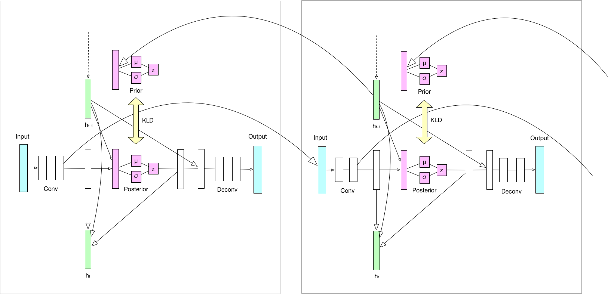
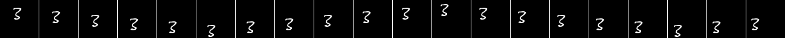
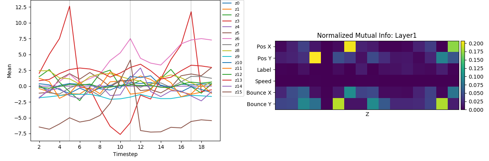
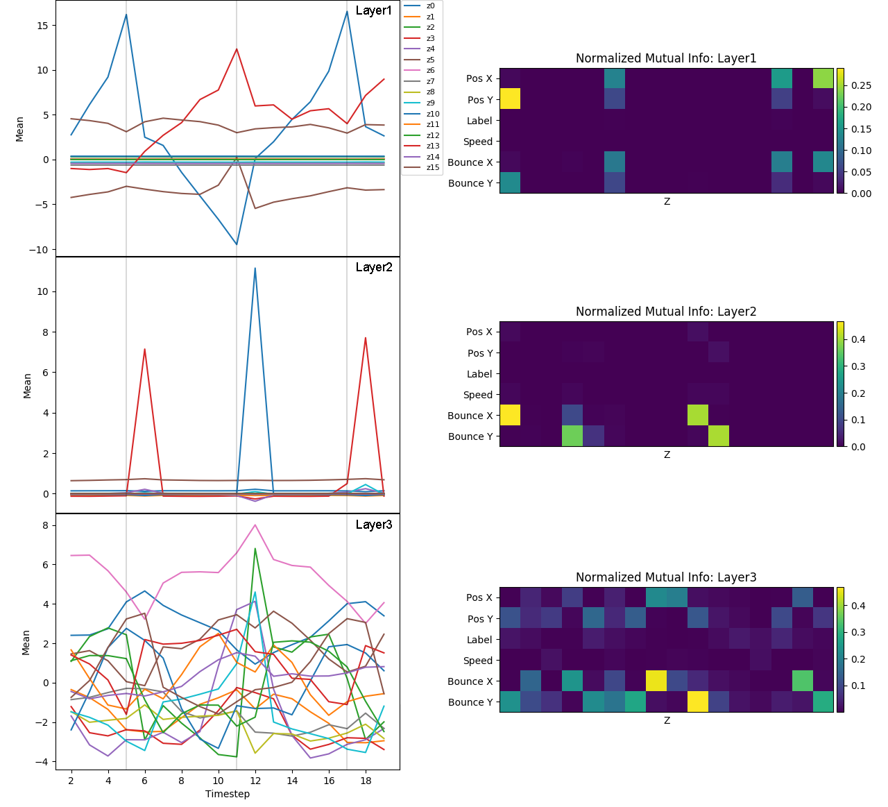

# Hierarchical variational autoencoder (HVRNN)

Code for the paper "Do top-down predictions of time series lead to sparse
disentanglement?" (Miyoshi et al. 2018)

Poster: https://drive.google.com/open?id=1zUrovQFNZ1AnSWkwGzEEgm2rk9lvoJY7

Paper: [http://jnns.org/conference/2018/JNNS2018_Proceedings/JNNS2018_Proceedings.pdf](http://jnns.org/conference/2018/JNNS2018_Proceedings/JNNS2018_Proceedings.pdf) [p15-16]

## Network

## Disentanglement result

Dataset: Moving MNIST

Figures on the left below show the mean of the latent variables in each hierarchical layers. Figures on the right below show the normalized mutual information between latent variables and the factors.

#### VRNN

#### HVRNN

