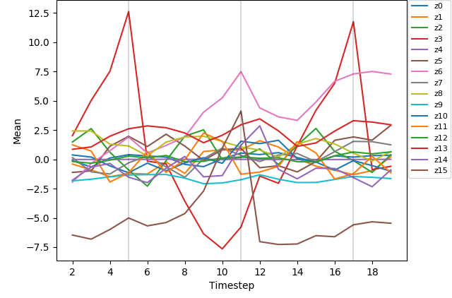
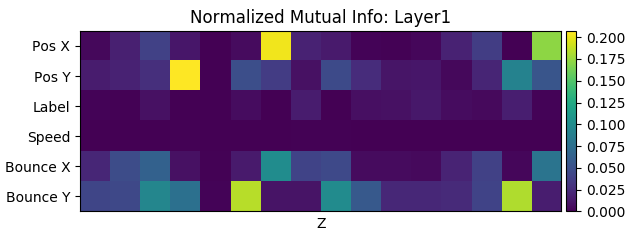
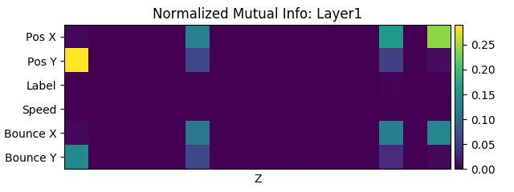
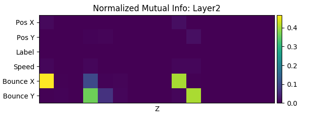
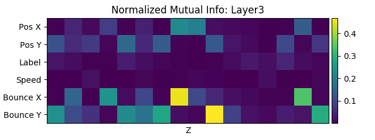

# Hierarchical variational autoencoder (HVRNN)

Code for the paper "Do top-down predictions of time series lead to sparse
disentanglement?" (Miyoshi et al. 2018)

Poster:

https://drive.google.com/open?id=1zUrovQFNZ1AnSWkwGzEEgm2rk9lvoJY7

## Network

## Results

### Latent

#### VRNN

#### HVRNN

### Mutual information

#### VRNN

#### HVRNN

